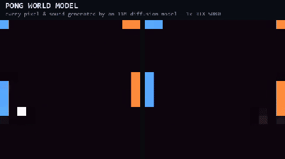

# Pong world model — MIRA at toy scale, with sound, on one RTX 5080

[](https://github.com/mira-wm/mira)&nbsp;
[](https://arxiv.org/abs/2607.05352)&nbsp;
[](LICENSE)

A fork of [mira-wm/mira](https://github.com/mira-wm/mira) that reproduces the **entire MIRA
pipeline** — multiplayer, real-time, latent-diffusion world model — on 16×16 two-player Pong,
small enough to train end-to-end on a **single RTX 5080 in an afternoon**, and extended to
**jointly generate sound effects**, which the original does not do. Trained weights are included;
you can play inside the model minutes after cloning.



Every pixel — and every beep, in the full demo with sound — is denoised from latents by an
11M-parameter diffusion transformer playing against itself in real time. No game engine runs
anywhere; the wall-bounce and paddle-hit sounds are the model's own predictions of what its
imagined physics should sound like.

All credit for the method and the codebase goes to the MIRA team (General Intuition, Kyutai, Epic
Games) — see their [paper](https://mira-wm.com/paper), [demo](https://mira-wm.com), and the
[original README](README.mira.md). Everything scientifically load-bearing here is **their code,
imported unmodified**: the diffusion transformer, the flow-matching + diffusion-forcing loss, the
PSD few-step self-distillation, the streaming KV-cache rollout, the multiplayer view-tiling
wrapper, and the codec's ViT decoder.

## What's the same as MIRA (deliberately)

The toy mirrors the paper stage for stage:

| MIRA | This toy |
|---|---|
| Rocket League 2v2, 4 players, 9-key keyboard | Pong, 2 players, 2-key vocabulary (Up/Down) |
| 10,000 h of Nexto-bot self-play + action-noise injection | ~5.5 h (780k frames) of scripted bots with reaction delay + action noise |
| 4 per-player camera views of a shared match | 2 mirrored first-person views (own paddle always left & blue) |
| RAE codec: frozen DINOv3-L → linear 2×2×2 bottleneck → causal space-time ViT decoder | Same shape: frozen SSL-pretrained ViT → same bottleneck → **mira's own `ViTVideoDecoder`** (16×16 @ 20 fps → 4×4×8 latents @ 10 Hz) |
| 5B DiT: flow matching + diffusion forcing, factorized space-time attention, AdaLN(actions+τ), GQA, RoPE | **Same class** (`mira.world_model.DiffusionTransformer`) at 10.6M: hidden 256, 8 blocks, GQA 8:2 |
| Multiplayer: tiled views, per-player action streams, action dropout, SP→MP warm start | **Same class** (`MultiWrapperWorldModel`) with `n_players=2` |
| Single-player 30k → multiplayer 100k steps → PSD distillation | 20k → 60k → 10k steps |
| 20 fps on one B200 (~70 ms/latent step) | 20 fps on one RTX 5080 (**11 ms**/latent step, `torch.compile`) |
| In-game clock/score HUD, 3 arenas, physics state logged for eval | Score-pip HUD, 3 background tints, ball/paddle physics logged for eval |

## What's different

1. **It generates audio.** MIRA's codec is video-only. This fork adds classic-Pong sound effects
   (movement ticks, wall/paddle collisions, score jingle) generated **jointly with the video** via
   a pointwise-sum trick borrowed from Kyutai's audio lineage: a tiny neural audio codec (55k
   params, the Mimi role) compresses each 100 ms of waveform into 8 continuous channels, which are
   broadcast over the 4×4 spatial grid and concatenated to the video latent channels. Since the
   DiT embeds tokens with one linear layer, that is mathematically a learned audio embedding
   *pointwise-summed into every spatial token* — the same additive fusion the architecture already
   uses for actions and flow time. Flow matching denoises all 16 channels jointly; **mira's
   transformer is unchanged**, and the audio model warm-starts from the video-only checkpoint
   (only the input/output projections change width). There is no event detector and no sound
   library at inference: sounds are denoised from noise, and their timing must be inferred from
   the model's *own* imagined dynamics.
2. **The frozen feature extractor** is a 0.2M ViT pretrained with masked reconstruction on Pong
   frames — DINOv3-L cannot run on 16×16 images. Same role, same multi-block aggregation.
3. **Single-GPU training loops** (~100 lines each) replace the Hydra/torchrun/W&B multi-node
   trainers, keeping the published hyperparameters (AdamW 1e-4, β=(0.9, 0.99), wd 0.1, 1k-warmup →
   constant, grad clip 1.0, weight EMA). The whole dataset lives in VRAM; there is no dataloader.

## Results (single RTX 5080, 16 GB)

| Metric | Value |
|---|---|
| Codec reconstruction (held-out) | 36.4 dB PSNR — the 1 px ball survives the bottleneck |
| Single-player rollout | plateaus ~20 dB (opponent unpredictable without their actions) |
| **Multiplayer rollout** | **35.6 dB** — saturates the codec ceiling (the paper's MP > SP finding, in miniature) |
| Action Recoverability (paddles obey commanded keys in generated video) | 0.998 |
| **Audio–video consistency** (beep accompanies the bounce in the model's *own* imagination) | **wall 0.84 / paddle-hit 0.70** |
| Physics probe R² from codec latents | paddles 0.98 / ball position 0.77 |
| Streaming speed (2-step denoising, compiled, incl. decode) | 11 ms/latent step ≈ 177 fps equivalent |

Training cost on the one GPU: **~23 min** codec, **~4 h** video world model (55 min
single-player, then 2 h 40 min multiplayer, then 22 min PSD), **~70 min** audio extension
(2 min audio codec + 25k warm-started steps). Roughly four orders of magnitude less compute
than the original.

## Quickstart

```bash
# prerequisites: an NVIDIA GPU and torch >= 2.8 with CUDA (https://pytorch.org)
pip install -e . --no-deps
pip install einops pydantic tqdm omegaconf numpy pillow pygame
pip install triton-windows          # Windows only, enables torch.compile

# 1. Regenerate the dataset (seeded; ~2 s) — weights are included, data is not
python -m examples.pong.generate_data

# 2. Play inside the trained audio-video world model (W/S vs arrows; 1/2 hand a player to the model)
python -m examples.pong.play_av

# 3. Evaluation probes / retraining from scratch
python -m examples.pong.eval_probe
python -m examples.pong.train_codec && python -m examples.pong.train_wm --stage all
python -m examples.pong.train_av
```

Included checkpoints: `examples/pong/runs/codec/codec.pt` (+ SSL extractor),
`examples/pong/runs/av/wm_av.pt` (the audio-video multiplayer model) and its
`audio_codec.pt`. The video-only intermediate checkpoints are reproducible with the commands
above.

More detail: [`examples/pong/README.md`](examples/pong/README.md) (stage-by-stage mapping) and
[`examples/pong/index.html`](examples/pong/index.html) (a self-contained write-up with an
interactive training-data viewer — open it in a browser).

## Citation

If any of this is useful, cite the MIRA team — it's their method and their code:

```
@article{mira2026,
  title={{MIRA}: Multiplayer Interactive World Models with Representation Autoencoders},
  author={Hu, Anthony and Volhejn, V{\'a}clav and Ramanana Rahary, Adrien and Mulder, Chris and Makkar, Aditya and Liao, Alyx and Royer, Am{\'e}lie and Orsini, Manu and Jelley, Adam and Alonso, Eloi and Laurent, Florian and Nor{\'e}n, Fredrik and Swingos, James and H{\"u}nermann, Jan and Rollins, Kent and Hosseini, Lucas and Le Cauchois, Matthieu and Peter, Maxim and de Witte, Pim and Brown, Tim and Micheli, Vincent and B{\"o}hle, Moritz and de Marmiesse, Gabriel and Sharmanska, Viktoriia and Specia, Lucia and Black, Michael and P{\'e}rez, Patrick},
  year={2026},
  note={Technical Report, arXiv:2607.05352},
}
```

## License

Apache 2.0, same as upstream. This fork adds only `examples/pong/`; `src/mira` is untouched.
